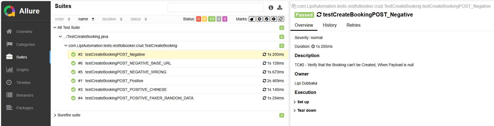
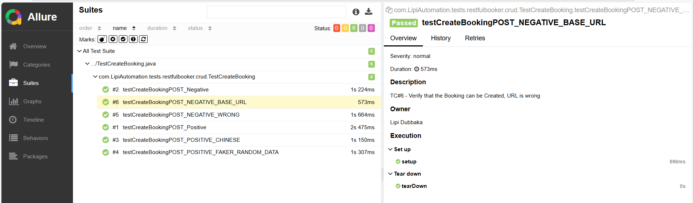

# 🛠 API Automation RestAssured (in Java)

**Author:** Lipi Dubbaka 

📌 API Automation Framework with the CRUD of Restful Booker.

---

## 🚀 Run Command

```
mvn test -Dsurefire.suiteXmlFiles=testng.xml
```

---
## 📸 Screenshots

---
## 🧰 Tech Stack

- Java (JDK > 22)
- Rest Assured
- Apache POI, TestNG, Maven
- AssertJ (Advanced assertions)
- Jackson API and GSON
- Log4j
- Allure Report
- Full Folder Structure (Hybrid) Framework
- Jenkins File
---
## 📂 API Framework Important Components
```
📦 Dependency & Project Management
- Maven *(Java)*  
- Gradle *(Java / Kotlin)*  
- PIP *(Python)*  
- NPM *(JavaScript / TypeScript)*  
- NuGet *(C# / .NET)*   

📊 Data Management
- Excel, JSON, Properties, XML files  
- **Libraries:** Apache POI, Fillow  

🔗 Payload & Endpoint Management
- JSON Strings  
- JSON Maps  
- POJOs  
- Serialization & Deserialization  
- GSON  

🧪 Test Management
- **Frameworks:** TestNG & Allure  
- Precondition / Postcondition / Setup / Teardown  
- Configurations, Steps, Descriptions, Priority, Severity, Execution  

♻ Reusable Components
- Keywords  
- Abstraction, Inheritance, Java Generics  
- Configs, Specs, Setups, Helpers  

📝 Logging
- TestNG Logs  
- Allure Logs  
- Log4J  

📑 Reporting
- Test Summary, Pass/Fail Percentage, Steps, Description, Failure Reason, Logs (Allure)  

🛠 Utilities
- String Manipulators, JSON Manipulators, Data Manipulators  
- Readers/Writers, Custom Tools, Faker  

🚀 CI/CD & Version Control
- Git & GitHub  
- Jenkins / TeamCity / Travis CI  
- Jenkinsfile for pipeline automation  

```
---
## ⚙ Running via CI/CD

---
## 📝 Basic Create Test

📦 Install Maven

Add config to run the suite in pom.xml:
```xml
<build>
    <plugins>
        <plugin>
            <groupId>org.apache.maven.plugins</groupId>
            <artifactId>maven-surefire-plugin</artifactId>
            <version>3.3.0</version>
            <configuration>
                <suiteXmlFiles>
                    <suiteXmlFile>${suiteXmlFile}</suiteXmlFile>
                </suiteXmlFiles>
            </configuration>
        </plugin>
    </plugins>
</build>
```
---
## ▶ Run Command
```
mvn clean test -DsuiteXmlFile=testng.xml
```
---
## ⚡ Parallel Execution

Add parallel attribute to your testng.xml file:
```
<suite name="All Test Suite" parallel="methods" thread-count="2">
```
---
## 🔗 Integration Test
```
mvn clean test -DsuiteXmlFile=testng-integration.xml
```
---
## 📊 Allure Report
```
allure serve allure-results/
```

---
## 📖 Allure Setup Guide

### 1️⃣ Install Allure
#### 🖥 Windows
Download from [Allure Official Releases](https://github.com/allure-framework/allure2/releases)
- Extract the ZIP file
- Add the `bin` folder to your **System PATH**
- Verify installation:
```powershell
allure --version
```
💻 macOS
```
brew install allure
```
---
### 2️⃣ Add Dependency in pom.xml
```xml
<dependency>
    <groupId>io.qameta.allure</groupId>
    <artifactId>allure-testng</artifactId>
    <version>2.13.0</version>
</dependency>
```
---
### 3️⃣ Add Allure Maven Plugin
```xml
<build>
    <plugins>
        <plugin>
            <groupId>io.qameta.allure</groupId>
            <artifactId>allure-maven</artifactId>
            <version>2.10.0</version>
            <configuration>
                <reportVersion>2.13.0</reportVersion>
            </configuration>
        </plugin>
    </plugins>
</build>
```
---
### 4️⃣ Run Tests
```
mvn clean test
```
(Allure results will be in target/allure-results)

---
### 5️⃣ Generate Report
```
allure generate target/allure-results --clean -o allure-report
```
---
### 6️⃣ View Report
```
allure open allure-report
```
---
## 💡 Tips:

- Use @Severity to indicate test priority.
- Attach screenshots for better debugging (useful for UI tests).
- Explore advanced configs in Allure docs.
---
## 🧪 Try These Cases (Postman Assignments)
- App → Restful Booker (with Auth)
- Create a Booking → Update Booking Name → Get Booking by ID → Verify.
- Create a Booking → Delete by ID → Verify with GET (should not exist).
- Get Existing Booking from All IDs → Update Booking → Verify via GET by ID.
- Create Booking → Delete It.
- Invalid Creation → Wrong payload / Wrong JSON.
- Try Updating a Deleted ID.

---
## ✅ Test for Single Request

- Response
- Status Code
- Headers

---
## 📌 Create Postman Collection

- RestfulBooker CRUD Operations
- Add from Snippets → Test Cases
- Integration Scenarios (Hardcoded)

---